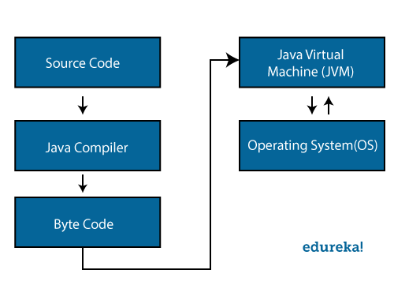
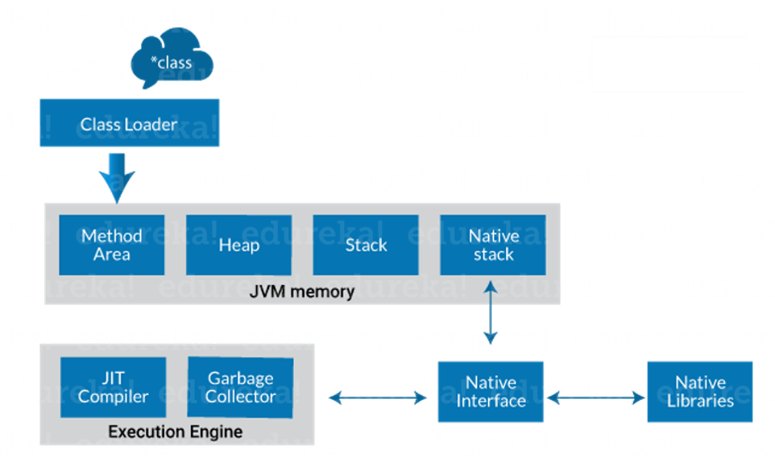
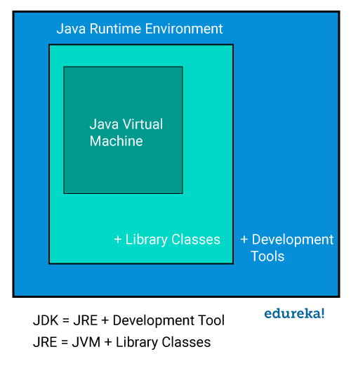
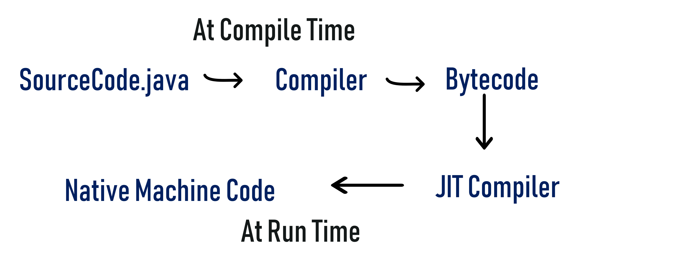

# Java Notes
My notes from reading the book Java Cookbook by Ian F. Darwin and my some of my own notes.

## The History and Evolution of Java
* Computer language innovation and development occurs for two fundamental reasons:
  1. To adapt to changing environments and uses
  2. To implement refinements and improvements in the art of programming
* Java's Lineage
  * The birth of modern programming: C
    * The creation of C was a direct result of the need for a structured, efficient, high-level language that could replace
    assembly code when creating systems programs.
    * As you probably know, when a computer language is designed, trade-offs are often made, such as the following:
      * Ease-of-use versus power
      * Safety versus efficiency
      * Rigidity versus extensibility
    * Prior to C, programmers usually had to choose between languages that optimized one set of traits or the other. For
    example, although FORTRAN could be used to write fairly efficient programs for scientific applications, it was not very
    good for system code. And while BASIC was easy to learn, it wasn't very powerful, and its lack of structure made its 
    usefulness questionable for large programs. Assembly language can be used to produce highly efficient programs, but it's
    not easy to learn or use effectively. Further, debugging assembly code can be quite difficult. 
    * Another compounding problem was that early computer languages such as BASIC, COBOL, and FORTRAN were not designed around
    structured principals. Instead, they relied upon the GOTO as a primary means of program control. As a result, programs
    written using these languages tended to produce "spaghetti code"--a mass of tangled jumps and conditional branches that
    make a program virtually impossible to understand. While languages like Pascal are structured, they were not designed
    for efficiency, and failed to include certain features necessary to make them applicable to a wide range of programs.
    (Specifically, given the standard dialects of Pascal available at the time, it was not practical to consider using Pascal
    for systems-level code.)
  * C++: The next step
    * During the late 70s and early 80s, C became the dominant computer programming language, and it's still widely used today.
    Since C is a successful and useful language, you might ask why a need for something else existed. The answer is *complexity*.
    * C++ is a response to that need.
    * The 1960s gave birth to *structured programming*. This is the method of programming championed by languages such as C. The
    use of structured languages enabled programmers to write, for the first time, moderately complex programs fairly easily. However,
    even with structured programming methods, once a project reaches a certain size, its complexity exceeds what a programmer can
    manage. By the early 1980s, many projects were pushing the structured approach past its limits. To solve this problem, a new way
    to program was invented, called *object oriented programming (OOP)*.
    * In the final analysis, although C is one of the world's great programming languages, there's a limit to its ability to
    handle complexity. Once the size of the program exceeds a certain point, it becomes so complex that is difficult to grasp
    as a totality. While the precise size at which this occurs differs, depending upon both the nature of the program and the
    programmer, there is always a threshold at which a program becomes unmanageable. C++ added features that enabled this threshold
    to be broken, allowing programmers to comprehend and manage larger programs.
* The creation of Java
  * The language was initially called "Oak," but was renamed "Java" in 1995.

## JVM Memory Model
* `-xmx` - defines max heap size of your JVM
* If you set `xmx` to 2GB, will your java process (application memory) go beyond 2GB?
  * Yes
  * Java Heap has 2 regions, *young generation* and *old generation*
    * When you create a new object, it gets created in young generation
    * If the object is long lived, it will get promoted to old generation
    * Most objects are short lived objects. Short lived objects get created in young generation region and die there too
  * `- xmx` defines size for young generation and old generation **alone**
  * In addition to old generation and new generation, there is also *metaspace*
    * In *metaspace*, the JVM stores the metadata information to run the application, like class definitions, method
    definitions,
    * Size can be defined by max-metaspace
  * There's an additional space called *others*
    * A Java application creates a lot of threads to process the incoming records which are stored in *others*
      * threads take up memory
      * you can define your thread size (size of one thread) via this property `- xss`
      * For example, lets say you define `- xss` to be 1mb, and your application creates 200 threads, then this adds 200mb
      to your overall application memory
    * Garbage collection is also stored in *others*
    * A Java process opens a lot of socket buffers for inbound connections also stored in *others*
    * File descriptors (opening a file) also need memory, also stored here in *others*
    * There is no parameter to define the size of *others* region
  * To conclude, when you define `xmx`, you are only defining the space for young generation and old generation. There is
  also metaspace and others, which add memory on top of the 2GB that you defined.
  
* How much memory does a Java thread take?
  * A memory which is taken by all Java threads, is a significant part of the total memory consumption your application.
  * There are a few techniques on how to limit the number of created threads, depending on whether your application is
  CPU-bound or IO-bound. If your application is rather IO-bound, you will very likely need to create a thread pool with
  a significant number of threads which can be bound to some IO operations (in blocked/waiting state, reading from DB,
  sending HTTP request).
  * However, if your app rather spends time on some computing task, you can, for instance, use HTTP server (ex Netty) with a lower
  number of threads and save a lot of memory.
  * To see the memory settings in java use this 
  `java -XX:+UnlockDiagnosticVMOptions -XX:NativeMemoryTracking=summary -XX:+PrintNMTStatistics -version`
  * We can see two types of memory:
    * Reserved - the size which is guaranteed to be available by a host's OS (but still not allocated and cannot be accessed
    by JVM) - it's just a promise.
    * Committed - already taken, accessible, and allocated by JVM
  * In the section `Thread`, we can spot the same number in Reserved and Committed memory, which is very close to a
  `number of threads * 1MB`. The reason is that the JVM aggressively allocates the maximum available memory for threads
  from the very beginning.
  
* Java Garbage Collection
  * Java manages heap memory for you. You run your application inside a virtual machine (JVM). The JVM does the work for
  of allocating space when necessary and freeing it when it is no longer needed. The garbage collector (GC) is what does
  this work for you.
  * **Recycling memory involves garbage collection "cycles" that have an impact on performance.** How much impact depends
  on the nature of your application and the GC you choose. 
  * New Garbage Collectors - the last releases of Java introduced 3 new GCs. Java 11 introduced Epsilon and the Z garbage
  collector (ZGC). Java 12 adds the Shenandoah garbage collector.
    * Epsilon is the "no-op" garbage collector. It allocates new memory but never recycles it. When your application exhausts
    the Java heap, the JVM shuts down. If you need to squeeze every bit of performance out of your application, Epsilon
    might be your best option for a GC. But you need to have a complete understanding of how your code uses memory. If it
    creates almost no garbage or you know exactly how much memory it uses for the period it runs in, Epsilon is a viable
    option.
    * ZGC promises to manage vast amounts of memory with high throughput and short pause times. ZGC is a low-latency GC
    designed to work well with huge amounts of memory. The Oracle documentation refers to multi-terabyte heaps in its
    description of Z. It's only available on 64-bit linux.
      * How does ZGC work?
        * ZGC works concurrently with your application, performing all of its work in threads. It uses load barriers for heap
        references. Load barriers cause fewer delays than those imposed by the G1 collector's pre-and-post-write barriers.
        * ZGC takes advantage of 64-bit pointers with a technique called pointer coloring. Colored pointers store extra 
        information about objects on the heap. (This is one of the reasons it's limited to the 64-bit JVM.) By limiting the
        GC to 4TB heaps, the developers have 22 extra bits in each pointer to encode additional information. Z uses 4 extra
        bits at the moment. Each pointer has a bit for `finalizable`, `remapped`, `mark0`, or `mark1`.
        * ZGC remaps objects when memory becomes fragmented. The mapping avoids the performance hit incurred when the GC needs
        to find space for a new allocation. Pointer coloring helps with remapping since a remapped reference discovers the new
        location at the next access.
        * When your application loads a reference from the heap, ZGC checks the extra bits. If it needs to do any extra work
        (e.g., getting a remapped instance), it handles it in the load barrier. It only has to do this once, when it loads the
        reference. This sets it apart from the write barriers used by mainline garbage collectors like G1.
        * ZGC performs its cycles in its threads. It pauses the application for an average of 1 ms. The G1 and Parallel collectors
        average roughly 200ms.
      * How to use ZGC?
      
        | COMMAND LINE OPTIONS | NOTES |
        | --- | --- |
        | `-XX:+UnlockExperimentalVMOptions` | Unlock Java experimental options |
        | `-XX:+UseZGC` | Use ZGC |
        | `-XmxXg` | Set heap size |
        | `-XX:ConcGCThreads=X` | Set number of GC threads |
        * ZGC is a concurrent garbage collector, so setting the right heap size is very important. The heap must be large
        enough to accomodate your application but also needs extra headroom so Z can meet new requests while relocating
        active objects. The amount of headroom you need depends on how quickly your application requests new memory.
        * ZGC will try to set the number of threads itself, and it's usually right. But if ZGC has too many threads, it 
        will starve your application. If it doesn't have enough, you'll create garbage faster than the GC can collect it.
      * Why use ZGC?
        * ZGC's design works well with applications with large heap sizes. It manages these heaps with pause times under
        10ms and little impact on throughput. These times are better than G1's.
        * ZGC does it's marking in three phases.
          * The first is a short stop-the-world phase. It examines the GC roots, local variables that point to the rest
          of the heap. The total number of these roots is usually minimal and doesn't scale with the size of the load, so
          ZGC's pauses are very short and don't increase as your heap grows.
          * Once the initial phase completes, ZGC continues with a concurrent phase. It walks the object graph and examines
          the colored pointers, marking accessible objects. The load barrier prevents contention between the GC phase and
          any application's activity.
          * After ZGC has completed marking, it moves live objects to free up large sections of the heap to make allocations
          faster. When the relocation phase begins, ZGC divides the heap into pages and works on one page at a time. Once
          ZGC finishes moving any roots, the rest of the relocation happens in a concurrent phase.
        * ZGC's phases illustrate how it manages large heaps without impacting performance as application memory grows.
      * Updates in JDK 13
        * ZGC's original design did not allow for memory pages to be returned to the OS when they were no longer required,
        e.g. when the heap shrinks and the memory is unused for an extended period of time. For environments such as
        containers, where resources are shared between a number of services, this can limit the scalability and efficiency
        of the system.
        * The ZGC heap consists of a set of heap regions called *ZPages*. When ZPages are emptied during a GC cycle, they
        are returned to the *ZPageCache*. ZPages in this cache are organized in order of those used least recently. In
        JDK 13, the ZGC will return pages that have been identified as unused for a sufficiently long period of time to
        the OS. This allows them to be reused for other processes. Uncommitting memory will never cause the heap size to
        shrink below the minimum size specified on the command line. If the minimum and maximum heap sizes are set to the
        same value, no memory will be uncommitted.
    * Shenandoah like ZGC, it manages large heaps with short pause times but uses a very different approach.
      * What is Shenandoah?
        * Another GC with low pause times. These times are short and predictable, regardless of the size of the heap.
        Shenandoah was developed at Red Hat and has been around for several years. It is now part of the Java 12 release.
        * Like ZGC, it does most of its work in parallel with the running application. But its approach to garbage collection
        is different. Shenandoah uses memory regions to manage which objects are no longer in use and which are live and
        ready for compression. Shenandoah also adds a forwarding pointer to every heap object and uses it to control access
        to the object.
      * How does Shenandoah work?
        * Shenandoah's design trades concurrent CPU cycles and space for pause time improvements. The forwarding pointer
        makes it easy to move objects, but the aggressive moves mean Shenandoah uses more memory and requires more parallel
        work than other GC's. But it does the extra work with very brief stop-the-world pauses.
      * Shenandoah Phases
        * Shenandoah processes the heap in many small phases, most of which are concurrent with the application. This design
        makes it possible for the GC to manage a large heap efficiently.
        * The first phase contains the first stop-the-world pause in the cycle. It prepares the heap for concurrent marking
        and scans the root set. Like ZGC, the length of this pause corresponds to the size of the root set, not the heap.
        Next a concurrent phase walks the heap and identifies reachable and unreachable objects.
        * The third finishes the process of marking by draining pending heap updates and re-scanning the root set. This
        phase triggers the second stop-the-world pause in the cycle. The number of pending updates and size of the root set
        determine how long the pause is.
        * Then, another concurrent phase copies the objects out of the regions identified in the final mark phase. This
        process sets Shenandoah apart from other GC's since it aggressively compacts the heap in parallel with application
        threads.
        * The next phase triggers the third (and shortest pause) in the cycle. It ensures that all GC threads have finished
        evacuation. When it finishes, a concurrent phase walks the heap and updates references to objects moved earlier in
        the cycle.
        * The last stop-the-world pause in the cycle finishes updating the references by updating the root set. At the same
        time, it recycles the evacuated regions. Finally, the last phase reclaims the evacuated regions, which now have no
        references in them.
      * How to use Shenandoah?
      
      | COMMAND LINE OPTIONS | NOTES |
      | --- | --- |
      | `-XX:+UnlockExperimentalVMOptions` | Unlock Java experimental options |
      | `-XX:+UseShenanodoahC` | Use Shenandoah GC |
      | `-XmxXg` | Set heap size |
      | `-XX:ShenandoahGCHeuristics=` | Select heuristics |
      
    * Shenandoah Heuristics - You can configure Shenandoah with one of three heuristics. They govern when the GC starts its
    cycles and how it selects regions for evacuation.
      1. Adaptive: Observes GC cycles and starts the next cycle so it completes before the application exhausts the heap.
      This heuristic is the default mode.
      2. Static: Starts a GC cycle based on heap occupancy and allocation pressure.
      3. Compact: Runs GC cycles continuously. Shenandoah starts a new cycle as soon as the previous one finishes or based
      on the amount of heap allocated since the last cycle. This heuristic incurs throughput overhead but provides the best
      space reclamation.
    * Failure Modes - Shenandoah needs to collect heap faster than the application it's serving allocates it. If the allocation
    pressure is too high and there's not enough space for new allocations, there will be a failure. Shenandoah has configurable
    mechanisms for this situation.
      * Pacing: If Shenandoah starts to fall behind the rate of allocation, it will stall allocation threads to catch up.
      The stalls are usually enough for mild allocation spikes. Shenandoah introduces delays of 10ms or less. If pacing
      fails, Shenandoah will move to the next step: degenerated GC
      * Degenerated GC: If an allocation failure occurs, Shenandoah starts a stop-the-world phase. It uses the phase to
      complete the current GC cycle. Since a stop-the-world doesn't contend with the application for resources, the cycle
      should finish quickly and clear the allocation shortfall. Often, a degenerated cycle happens after most of the cycle's
      work is already completed, so the stop-the-world is brief. The GC log will report it as a full pause, though.
      * Full GC: If both pacing and degenerated GC fail, Shenandoah falls back to a full GC cycle. This final GC guarantees
      the application wont fail with an out-of-memory error unless there's no heap left.
    * Why use Shenandoah?
      * Shenandoah offers the same advantages as ZGC with large heaps but more tuning options. Depending on the nature of
      your application, the different heuristics may be a good fit. Its pause times might not be as brief as ZGC's, but they
      are more predictable. While Shenandoah was not made available as part of Java until version 12, it's been around longer
      than ZGC. It's seen more testing and is even available as a backport for both java 8 and 10.
       
## The Java Platform
Java is a platform which means it provides a platform to develop the application. It offers a group of programs that are
developed and runs the program written in java language. It is an independent platform that has a compiler, execution
engine, and a set of libraries. The java environment like Java Virtual Machine and Java Run-time Environment convert code
into machine language.

The bytecode makes the java platform independent. Jlink is a command-line tool that allows to link sets of modules to
create run-time images.

The link-time applies between compile time and run time. It simplifies and reduces the size of deployment. Java Dependency
Analysis Tool (jdep) is a command-line tool that processes Java bytecode i.e. .class files or JARs that contain them. Jdep
can also tell which JDK-internal APIs the project is using. With the help of this tool, you can examine various types of
dependency graphs.

### What is Java Architecture
* In Java, there is a process of compilation and interpretation
* The code written in Java, is converted into byte codes which is done by the Java Compiler
* The byte codes, then are converted into machine code by the JVM
* The machine code is executed directly by the machine



#### Components of Java Architecture
There are 3 main components of the Java language: 
**JVM** (Java Virtual Machine), **JRE** (Java Runtime Environment), and 
**JDK** (Java Development Kit).

##### Java Virtual Machine
Java applications are called WORA (Write once Run Anywhere) because of their ability to run a code on any platform.
This is done because of the JVM. The JVM is a java platform component that provides an environment for executing java
programs. JVM interprets the bytecode into machine code which is executed in the macine in which the java program
runs. So in a nutshell, the JVM performs the following functions:
* loads the code
* verifies the code
* executes the code
* provides runtime environment



* **Class Loader**: is a subsystem of JVM. It is used to load class files. Whenever we run the java program, class loader
  loads it first.
* **Class method area**: it is one of the Data Area in the JVM, in which Class data will be stored. Static Variables,
  Static Blocks, Static Methods, Instance Methods are stored in this area.
* **Heap**: A heap is created when the JVM starts up. It may increase or decrease in size while the application runs.
* **Stack**: JVM stack is known as a thread stack. It is a data area in the JVM memory which is created for a single
  execution thread. The JVM stack of a thread is used by the thread to store various elements i.e; local variables, partial
  results, and data for calling method and returns.
* **Native stack**: it subsumes all the native methods used in your application.
* **Execution Engine**:
  * **JIT compiler**:
    * The Just-In-Time (JIT) compiler is part of the runtime environment. It helps in improving the performance of Java
      applications by compiling bytecodes for machine code at run time. The JIT compiler is enabled by default. When a
      method is compiled, the JVM calls the compiled code of that method directly. The JIT compiler compiles the bytecode
      of that method into machine code, compiling it "just in time" to run.
    * The byte code has to be interpreted or compiled to proper machine instructions depending on the instruction set provided.
      Also, these can be directly executed if the instruction architecture is byte code based. Interpreting the byte code
      affects the speed of execution.
    * In order to improve performance, JIT compilers interact with the JVM at run time and compile suitable bytecode sequences
      into native machine code. When using a JIT compiler, the hardware is able to execute the native code, as compared to
      having the JVM interpret the same sequence of bytecode repeatedly and incurring overhead for the translation process.
  * **Garbage collector**:
    * means to collect the unused material. In the JVM, this work is done by Garbage collection. It tracks each and every
      object available in the JVM heap space and removes unwanted ones. Garbage collector works in 2 simple steps known
      as Mark and Sweep:
      * Mark - it is where the garbage collector identifies which piece of memory is in use and which are not
      * Sweep - it removes objects identified during the "mark" phase
* **Java Runtime Environment**:
  * The JRE software builds a runtime environment in which Java programs can be executed. The JRE is the on-disk system
    that takes your java code, combines it with the needed libraries, and starts the JVM to execute it. The JRE contains
    libraries and software needed by your Java programs to run. JRE is a part of JDK but can be downloaded separately.
* **Java Development Kit**
  * The JDK is a software development environment used to develop java applications and applets. It contains JRE and several
    development tools, an interpreter/loader (java), a compiler (javac), an archiver (jar), a documentation generator (javadoc)
    accompanied with another tool.
    


The blue area shown in the diagram is JDK. Development tools:
* `java`: it is the launcher for all the java applications
* `javac`: compiler of the java programming languages
* `javadoc`: it is the apli documentation generator
* `jar`: creates and manage all the JAR files

##### How is Java platform independent?
When is any programming language called as platform-independent? Well, if and only if it can run on all available OS with
respect to its development and compilation. Now Java is platform-independent just because of the bytecode. In simple terms,
Bytecode is a code of the JVM in which is machine-understandable. Bytecode execution in Java proves it is a platform-independent
language. 



**sample.java -> javac (sample.class) -> JVM (sample.obj) -> final output**

First source code is used by java compiler and is converted into a .class file. The class file is in byte code form and
that class file is used by JVM to convert it into an object file. After that, you can see the final output on your screen.

## Compiling, Running, and Debugging

### Avoiding the need for debuggers with Unit Testing
* To avoid constantly debugging your code, use unit testing to validate each class as you develop it.
* Typically, in an OO language like Java, unit testing is applied to individual classes, in contrast to "system" or "integration" testing where the entire application is tested.
* Developers of the software methodology known as Extreme Programming (XP for short) advocate "Test Driven Development"(TDD): writing the unit tests before you write the code. They also advocate running your tests almost every time you build your application.

### Maintaining your code with Continuous Integration
* To be sure that your entire code base compiles and passes its tests periodically, use a Continuous Integration server such as Jenkins/Hudson.
* CI is simply the practice of having all developers on a project periodically integrate their changes into a single master copy of the project's "source". This might be a few times a day, or every few days, but should not be more than that, else the integration will likely run into larger hurdles where multiple developers have modified the same file.
* And it's not just code-based projects that benefit from CI. If you have a number of small websites, putting them all under CI control is one of the several important steps toward developing an automated, "dev-ops" culture around website deployment and management.

## Dates and Times
Look at programming.DatesAndTime

### Parsing strings into dates
You need to convert user input into `java.time` objects.
* Use a `parse()` method
* Many of the date/time classes have a `parse()` factory method, which tries to parse a string into an object of that
class. 
* As you probably expect by now, the default format is ISO8601 date format. However, we often have to deal with dates in
other formats. For this, the `DateTimeFormatter` allows you to specify a particular pattern. For example, "dd MMM uuuu"
represents the day of the month (two digits), three letters of the name of the month (Jan, Feb, ...), and a four digit
year.
* As its name implies, the `DateTimeFormatter` object is bidirectional; it can both parse input and format output. Ex:
`System.out.println(aLD + " formats as " + df.format(aLD));`

### Adding to or subtracting from a Date or Calendar
You need to add or subtract a fixed period to or from a date
* Create a past or future date by using a locution such as `LocalDate.plus(Period.ofDays(N))`
* `java.time` offers a `Period` class to represent a length of time, such as a number of days, or hours and minutes.
`LocalDate` and friends offer `plus()` and `minus()` methods to add or subtract a `Period` or another time-related
object. `Period` offers factory methods such as `ofDays()`.

### Interfacing with legacy Date and Calendar Classes
You need to deal with the old `Date` and `Calendar` classes
* Assuming you have code using the original `java.util.Date` and `java.util.Calendar`, you can convert values as needed
using conversion methods.
* To keep the mew API clean, most of the necessary conversion routines were added to the old API.

## Strings and Things
* Strings in Java are immutable. If you need to change characters within a String, you should instead create a StringBuilder (possibly initialized to the starting value of the String), manipulate the StringBuilder to your heart's content and then convert that to String at the end, using the ubiquitous toString() method.
  * It may be possible to tinker with the String's internal data structures using the Reflection API. Secured environments, of course, do not permit access to the Reflection API.
  
### Breaking strings into words
* To accomplish this, construct a StringTokenizer around your and call its methods hasMoreTokens() and nextToken().
* Or use regular expressions. ====> see /javanotes/StringNotes
* Many occurrences of StringTokenizer may be replaced with regular expressions with considerably more flexibility.

### Putting strings together with StringBuilder
* Use string concatenation: the + operator. The compiler implicitly constructs a StringBuilder for you and uses its append() methods. You can also construct a
StringBuilder yourself.
* StringBuilder and StringBuffer are identical, except for the fact that StringBuilder is not threadsafe

### Processing a String one character at a time
* Use a for loop and the String's charAt() method. Or a "for each" loop and the String's toCharArray method.

### Reverse a String by Word or by Character
* You can reverse a string by character easily, using a StringBuilder and calling the reverse(). ==> look at /javanotes/StringNotes

### Regex Processing
* regex - is a string of characters that describes a character sequence. This general description called a pattern can then be used to find matches in other character sequences. 
* Use the **Pattern** class to define a regular expression.
* Match the pattern against another sequence using **Matcher**.
* The simplest pattern matching method is **matches()**. For there to be a match, the entire character sequence must match the pattern, not just a subsequence of it. If it matches, matches() returns true, otherwise false.
* To determine if a subsequence of the input sequence matches the pattern, use **find()**. It returns true if there is a matching subsequence and false otherwise. This method can be called repeatedly allowing it to find all matching subsequences. Each call to find() begins where the previous one left off. 
* You can obtain a string containing the last matching sequence by calling **group()**.
* If no matching exists, then an **IllegalStateException** is thrown.
* You can replace all occurrences of a matching sequence with another sequence by calling **replaceAll()**.
* example, parsing the file name to get the extension
* <pre>Pattern pat = Pattern.compile("(\\.[^.]+)$");
  Matcher mat = pat.matcher("today.jpeg");
  // To get the extension first call find then group
  if(mat.find()) // if it finds an extension
    System.out.println(mat.group())
  else
    System.out.println("NO MATCH");
  </pre>
  
  
  
  
  
  
  
  
  
  
  
  
## Object Oriented Techniques
* Advice, or Mantras
  * Use the API
    * Exceptions
      * the `clone()` method in `java.lang.Object` should generally not be used. If you need to copy an object, just
      write a copy method or a "copy constructor".
      * Also, the `finalize()` method in java.lang.Object, dont use it. It isn't guaranteed to be invoked, but because
      it might get invoked, it will cause your dead objects not to be garbage collected, resulting in a memory leak. If
      you need some kind of cleanup, you must take responsibility for defining a method and invoking it before you let
      any object of that class go out of reference.
  * Generalize
    * There is a trade-off between generality (and the resulting reusability), which is emphasized here, and the convenience
    of application specificity. If you're writing one small part of a very large application designed according to OO design
    techniques, you'll have in mind a specific set of use cases. On the other hand, if you're writing "toolkit-style" code,
    you should write classes with few assumptions about how they'll be used. Making code easy to use from a variety of programs
    is the route to writing reusable code.
  * Read and Write Javadoc
  * Use subclassing and delegation
    * Use subclassing. But don't overuse subclassing.
    * There are several alternatives. One alternative to subclassing is delegation. Think about "is-a" versus "has-a". 
    For example, instead of subclassing NameAndAddress to make Supplier and Customer, make Supplier and Customer have
    instances of NameAndAddress. That is a clearer structure; having a supplier be a NameAndAddress just because a 
    supplier has a name and address would not make sense. And delegation also makes it easier for a Customer to have
    both a billing address and a shipping address.
    * Another alternative is aspect-oriented-programming (AOP), which allows you to "bolt on" extra functionality from the
    outside of your classes. AOP is provided by the Java EE using EJB Interception, and by the Spring Framework AOP mechanism.
  * Using Design Patterns
    * Read Design Patterns (Addison Wesley)
* Polymorphism and Interfaces
  * Basically, the best uses of polymorphism in Java is the ability to refer to a child class by using the parent class
  reference. In polymorphism, "many forms" means the ability of an object or method to take many forms. Method overriding
  and method overloading basically mean a behavior in Java that allows the developer to take advantage of that principle.
  * Basically, an interface is a contract that a developer must follow while implementing it. It states that when you are
  implementing something, you must provide the given set of the feature, or else you will be incomplete. Here, incomplete
  means that the class is not a complete one (for ex, an abstract class). Another advantage -- from a program design perspective -- is
  the idea of "programming to an interface, not implementations." That means that when we are designing our code, we should
  focus on the interface or the functionalities that the interface provides, not the actual implementation.
  
  
  
  
  
  
## Functional Programming Techniques: Functional Interfaces, Streams, Parallel Collections
* Functional Programming
  * ... a programming paradigm, a style of building the structure and elements of computer programs, that treats computation
  as the evaluation of mathematical functions and avoids state and mutable data.
  * Functional programming emphasizes functions that produce results that depend only on their inputs and not on the program
  state - i.e. pure mathematical functions.
  * It is a declarative programming paradigm, which means programming is done with expressions.

* Some features of FP include
  * Pure functions; having no side-effects and whose results depend only on their inputs and not on mutable state elsewhere
  in the program.
  * First-class functions (e.g. functions as data)
  * Immutable data
  * Extensive use of recursion and lazy evaluation
  * "Functions as data" means that you can create an object that is a function, pass into another function, write a function
  that returns another function, and so on--with no special syntax, because well, functions are data.
* One of Java 8's approach to FP is the definition of functional interfaces. Look at programming/Lambdaz.java
* Also new in Java 8, interfaces can have methods annotated with the new-in-this-context default keyword.
  * A default method in an interface becomes available for use in any class that implements the interface; you'll see that
  such methods cannot depend on instance state in a particular class because they would have no way of referring to it at
  compile time.
  * So a functional interface is more precisely defined as one that has a single nondefault method.
  
### Using Lambdas/Closures Instead of Inner Classes
* You want to avoid all the typing that even the anonymous style of inner classes requires. Use Java's lambda expressions.
===> look at programming/FunctionalProgramming.java

### Using Lambda Predefined Interfaces Instead of your Own
* You want to use existing interfaces, instead of defining your own, for use with Lambdas. Use the Java 8 lambda Functional
interfaces from java.util.function.

### Functional programming patterns with Java 8

**Prefer named functions over anonymous lambdas**

Always extract complex lambdas into functions with an expressive name that you can then reference using `::` from
* the same class (`this::`)
* another class (`mapper::`)
* some static helper method (`SomeClass::`)
* the Stream *item* type (`Item::`)
* even some constructor (`UserDto::new`), if its simple enough

In short never type `-> {`.

**Stream wrecks**

The idea here is to avoid excessive method chaining by introducing explanatory variables. This means extracting methods
and even work with variables of a function or `Stream` type, in order to make the code as clear as possible to your
reader.

**Fighting the greatest beast of all: Null Pointer**

Whenever null gives you problems in Java 8, don't hesitate to jump on Optional and apply transformation functions on the,
potentially empty, magic box. The clean code rule becomes, don't take Optional parameters; instead, return an Optional
whenever your function wants to signal to your caller that there might be NO return value in some cases.

**The Loan Pattern / Passing a block**

For the following exercise, let's export the orders to a CSV file
```java
interface OrderedRepo {
    List<Object> findByActiveTrue();
}
public class LoanPattern {
    private OrderedRepo orderedRepo;
    public File exportFile(String fileName) throws Exception {
        File file = new File("export/" + fileName);
        try (Writer writer = new FileWriter(file)) {
            writer.write("OrderID;Date\n");
            // Unchecked: you need this because write() throws IOException, even when the Consumer expected by the forEach
            // does not. You should suffer if you throw checked exceptions.
            orderedRepo.findByActiveTrue().map(o -> o.getId() + ";" + o.getCreationDate()).forEach(Unchecked.consumer(writer::write));
            return file;
        } catch (Exception e) {
            // Todo: Send email notification
            throw e;
        }
    }
}
```
I'll open a `Writer`, stream over all the orders, convert them, and then write each to the file. The vague odor of fear
at the end of this example stems from the possibility that, perhaps, no one will ever catch my exception afterward. Ideally,
you should trust your team with these exceptions, so that if they are thrown on any threads, they are gracefully caught
and logged.

There are many ways you could stray from the path of righteousness while doing that, including booleans, enum ExportType,
and @Overriding concrete methods, but I will sketch here an application of the Template Method design pattern.
```java
interface OrderedRepo {
    List<Object> findByActiveTrue();
}
abstract class FileExporter {
    public File exportFile(String filename) throws Exception {
        File file = new File("export/"+filename);
        try(Writer writer = new FileWriter(file)) {
            writeContent(writer);
        } catch (Exception e) {
            // todo: send email notification
            throw e;
        }
    }
    
    protected abstract void writeContent(Writer writer) throws IOException;
}

class OrderExportWriter extends FileExporter {
    private OrderRepo orderRepo;
    @Override
    protected void writeContent(Writer writer) throws IOException {
        writer.write("OrderID;Date\n");
        orderRepo.findByActiveValue().map(o -> o.getId() + ";" + o.getCreationDate())
            .forEach(Unchecked.consumer(writer::write));
    }
}
```

I want you to ask yourself: why did we use that dangerous word there? Why did we play with fire? What's the excuse for
that awful `extends` in the code? To force me to provide the missing logic, there will be a function `f(Writer):void`
whenever I subclass the `FileExporter`.

But we can do that a lot easier in Java 8. We just need to take a `Consumer<Writer>` as a method parameter!

```java
import java.io.IOException;interface OrderedRepo {
    List<Object> findByActiveTrue();
}
class FileExporter {
    public File exportFile(String filename, Consumer<Writer> contentWriter) throws Exception {
        File file = new File("export/" + filename);
        try (Writer writer = new FileWriter(file)) {
            contentWriter.accept(writer); // passing writer object
            return file;
        } catch (Exception e) {
            // todo: send email notification
            throw e;
        }
    }
}
class OrderExportWriter {
    private OrderRepo orderRepo;
    public void writeOrders(Writer writer) throws IOException {
        writer.write("OrderID;Date\n");
        orderRepo.findByActiveTrue().map(o -> o.getId() + ";" + o.getCreationDate())
            .forEach(Unchecked.consumer(writer::write));
    }
}
```

Wow, a lot of things have changed here. Instead of `abstract` and `extends`, the `exportFile()` function got a new
`Consumer<Writer>` parameter, which it calls to write the actual export content. To get the whole picture, let's sketch
the client code:

`fileExporter.exportFile("orders.csv", Unchecked.consumer(orderWrite::writeOrders));`

Here I had to use `Unchecked` again to make it compile, because `writeOrders()` declaration throws an exception!

The fundamental idea is that **whenever you have some "variable logic", you can consider taking it as a method parameter**.
The above example, however, is a slight variation, in which the function given as a parameter works with a resource that
is managed by the host function. In our example, `OrderExportWriter.writeOrders` receives a `Writer` as a parameter to
write the content to it. However, `writeOrders` is not concerned with creating, closing, or handling errors related to
`FileWriter`. That's why we call this the **Loan pattern**. **This is a function we pass in that is essentially borrowed
so the Writer can do its job**.

One major benefit of the *Loan pattern* is that it decouples nicely with the infrastructural code (`FileExporter`) from
the actual export format logic (`OrderExportWriter`). Through a better separation by layers of abstraction, this enables
a *Dependency Inversion*, i.e. you could keep the `OrderWriter` in a more interior layer. Because it decouples the code
so nicely, the design becomes a lot easier to reason with and unit test. You can test `writeOrders()` by passing it a
`StringWriter` and, afterward, see what was written to it. To test the `FileExporter`, you can pass simply a dummy
`Consumer` that just writes "dummy", and then verify that the infra code did its job.

There is one more variation of the *Passing-a-Block* pattern, the *Execute Around* pattern. Syntactically, the code is
very similar: `measure(() -> stuff()`. However, the purpose is slightly is different. Here, `stuff()` was already
implemented, but, afterward, we wanted to execute some arbitrary code around it (before and after). **With Execute Around,
we write this before/after code in some helper function and then wrap our original call within a call to this helper**.

The key takeaway of this section is that **you should force yourself into thinking about handling bits of logic and
juggling them as first-class citizens in Java 8**. It will make your code more elegant, simple, and expressive.

**How to implement type specific logic**
The task is simple: there are 3 movie types, each with its own formula for computing the price based on the loan number
of days.

One way to do it
```java
class Movie {
    enum Type {
        REGULAR, NEW_RELEASE, CHILDREN

    }

    private final Type type;
    public Movie(Type type) {
        this.type = type;
    }

    public int computePrice(int days) {

        switch (type) { 
            case REGULAR: return days + 1;
            case NEW_RELEASE: return days * 2;
            case CHILDREN: return 5;
            default: throw new IllegalArgumentException(); // Always have this here!
        }
    }
}
```
The problem in the code above could be the `switch`: whenever you add a new value to the enum, you need to hunt down all
the switches and make sure you handle the new case. But this is fragile. The `IllegalArgumentsException`will pop up, but
only if you walk the path from tests/UI/API. In short, although anyone can read this code, it's a bit risky.

One way to avoid this risk would be an OOP solution.

```java
abstract class Movie {
    public abstract int computePrice(int days);
}

class RegularMovie extends Movie {

    public int computePrice(int days) {
        return days+1;
    }
}

class NewReleaseMovie extends Movie {

    public int computePrice(int days) {
        return days*2;
    }
}

class ChildrenMovie extends Movie {

    public int computePrice(int days) {
        return 5;
    }
}
```
If you create a new type of movie, a new subclass actually, the code won't compile unless you implement `computePrice()`.
But, it `extends` again! What if you want to classify the movies by another criterion, say release year? Or how would
you handle the "downgrade" from a `Type.NEW_RELEASE` to a `TYPE.REGULAR` movie after several months?

One more requirement added to the original task. The factor in the price formula for new release movies must be updatable
via the database. This means that I have to get this factor from some injected repository. But, since I can't inject repos
in my `Movie` entity, let's move the logic to a separate class:

```java
public class PriceService {

    private final NewReleasePriceRepo repo;

    public PriceService(NewReleasePriceRepo repo) {
        this.repo = repo;
    }

    public int computeNewReleasePrice(int days) {
        return (int) (days * repo.getFactor());
    }

    public int computeRegularPrice(int days) {
        return days + 1;
    }

    public int computeChildrenPrice(int days) {
        return 5;
    }

    public int computePrice(Movie.Type type, int days) {

        switch (type) {
            case REGULAR: return computeRegularPrice(days);
            case NEW_RELEASE: return computeNewReleasePrice(days);
            case CHILDREN: return computeChildrenPrice(days);
            default: thrownew IllegalArgumentException();
        }
    }
}
```
But the `switch` is back with the inherent risks! Is there any way to make sure no one forgets to define the associated
price formula? And mow for the grand finale:

```java
public class Movie { 

   public enum Type {
        REGULAR(PriceService::computeRegularPrice),

        NEW_RELEASE(PriceService::computeNewReleasePrice),

        CHILDREN(PriceService::computeChildrenPrice);

        public final BiFunction<PriceService, Integer, Integer> priceAlgo;

        private Type(BiFunction<PriceService, Integer, Integer> priceAlgo) {
            this.priceAlgo = priceAlgo;
      }
   }
}
// And instead of the switch

class PriceService {
    // ...
    public int computePrice(Movie.Type type, int days) {
        return type.priceAlgo.apply(this, days);
    }
}
```
I am storing into each enum value a method reference to the corresponding instance method from `PriceService`. Since I
refer to instance methods in a static way (from `PriceService::`), I will need to provide the `PriceService` instance as
the first parameter at the invocation time. And I give it `this`. This way I can effectively reference methods from any
(Spring) bean from the static context of the definition of an enum value. Look at programming/MyEnumerations.java for an
example.

## Checked and Unchecked exceptions in java

### Checked Exceptions
In general, checked exceptions represent errors outside the control of the program. For example,
the constructor of `FileInputStream` throws *FileNotFoundException* if the input file does not
exist.

**Java verifies checked exceptions are compile-time.** Some common checked exceptions in Java are
`IOException`, `SQLException`, and `ParseException`. The `Exception` class is the superclass of
checked exceptions. Therefore, we can create a custom checked exception by extending *Exception*.


### Unchecked Exceptions
If a program throws an unchecked exception, it reflects some error inside the program logic. For
example, if we divide a number by 0, Java will throw an *Arithmetic Exception*.

**Java does not verify unchecked exceptions at compile-time**. Furthermore, we don't have to declare
unchecked exceptions in a method with the *throws* keyword. And although dividing by zero does not
throw any errors during compile-time, it will throw an *Arithmetic Exception* at runtime. Some
common unchecked exceptions in Java are *NullPointerException*, *ArrayIndexOutOfBoundsException*,
and *IllegalArgumentException*. The `RuntimeException` class is the superclass of all unchecked
exceptions. Therefore, we can create a custom unchecked exception by extending *RuntimeException*.

### When to use checked exceptions and unchecked exceptions
It's a good practice to use exceptions in Java so that we can separate error-handling code from
regular code. However, we can decide which type of exception to throw. The Oracle Java Documentation
provides guidance on when to use checked exceptions and unchecked exceptions:

> If a client can reasonably be expected to recover from an exception, make it a checked exception.
If a client cannot do anything to recover from the exception, make it an unchecked exception.

For example, before we open a file, we can first validate the input file name. If the user input
file name is invalid, we can throw a custom checked exception. In this way, we can recover the
system by accepting another user input file name. However, if the input file name is a null pointer
or it is an empty string, it means that we have some errors in the code. In this case, we should
throw an unchecked exception.

## Input and Output

### Streams and Readers/Writers
Java provides two sets of classes for reading and writing. The `Stream` section of package `java.io` is for reading and
writing bytes of data. Older languages tended to assume that a byte (which is a machine-specific collection of bits,
usually 8 bits on modern computers) is exactly the same thing as a "character"--a letter, digit, or other linguistic
element. However, Java is designed to be used internationally, and 8 bits is simply not enough to handle the many different
character sets around the world. Script-based languages like Arabic and Indian languages, and pictographic languages
like Chinese and Japanese, each have many more than 256 characters, the max that can be represented in an 8-bit byte.

The unification of these many character code sets is called Unicode. Both Java and XML use Unicode as their character
sets, allowing you to read/write text in any of these human languages. But you should use `Reader`s and `Writer`s, not
`Stream`s , for textual data.

Unicode itself doesn't solve the entire problem. Many of these human languages were used on computers long before Unicode
was invented, and they didn't all pick the same representation as Unicode. And they all have zillions of files encoded in
a particular external representation in which a user's files are written. These converters are packaged inside a powerful
set of classes called `Reader`s and `Writer`s.

### reading standard input
To read bytes, wrap a `BufferedInputStream()` around `System.in`. For the more common case of reading text, use an
`InputStreamReader` and a `BufferedReader`.

Most desktop platforms support the notion of standard input (a keyboard, a file, or the output from another program) and
standard output (a terminal window, a printer, a file on disk, or the input yet to another program). Most such systems
also support a standard error output so that error messages can be seen by the user even if the standard output is being
redirected. When programs on these platforms start up, the 3 streams are preassigned to particular platform-dependent
handles, or *file descriptors*. The net result is that ordinary programs on these operating systems can read the standard
input or write to the standard output or standard error stream without having to open any files or make any special
arrangements.

Java continues this tradition and enshrines it in the `System` class. The static variables `System.in`, `System.out`, and
`System.err` are connected to the 3 OS streams before your program begins execution (an application is free to reassign
these). So to read the standard input, you need only refer to the variable `System.in` and call its methods. 

For example, to read 1 byte from the standard input

```java
public class A {
    public static void main() {
        int b = 0;
        try {
            b = System.in.read();
            System.out.printf("\nyou typed %c", b);
        } catch (Exception e) {
            System.err.println("caught " + e);
        }
    }
}
```

Well, that certainly works and gives you the ability to read a byte at a time from the standard input. But most applications
are designed in terms of larger units, such as integers or lines of text. To read a value of a known type, such as an int,
from the standard input, you can use the Scanner class.

```java
public class A {
    public static void main() {
        Scanner sc = Scanner.create(System.in);
        int i = sc.nextInt();
    }
}
```

For reading characters of text with an input character converter so that your program will work with multiple input
encodings around the world, use a `Reader` class. The particular subclass that allows you to read lines of characters
is a `BufferedReader`. But there's a hitch. Remember those 2 categories of input classes, Streams and Readers? But also
that `System.in` is a Stream, and you want a Reader. How do you get from a Stream to a Reader? A "crossover" class called
`InputStreamReader` is tailor-made for this purpose. Just pass your Stream (like `System.in`) to the `InputStreamReader`
constructor and you get back a Reader, which in turn pass to the `BufferedReader` constructor.

For example, to read lines of text

```java
public class A {
    public static void main() {
        try{
            BufferedReader is = new BufferedReader(new InputStreamReader(System.in));
            String inputLine;
            while ((inputLine = is.readLine()) != null) {
                // if its an integer
                int val = Integer.parseInt(inputLine);
                System.out.println(val);
            }
        } catch (IOException e) {
            System.err.println("IOException: " + e);
        } catch (NumberFormatException e) {
            System.err.println("Not a number");   
        }
    }
}
```

### reading from the console or controlling terminal; reading passwords without echoing
You want to read directly from the program's controlling terminal or console terminal.

Use the Java 6 `System.console()` method to obtain a console object, and use its methods.

The `Console` class is intended for reading directly from a program's controlling terminal. When you run an application
from a "terminal window" or "command prompt window" on most systems, its console and standard input are both connected
to the terminal, by default. However, the standard input can be changed by piping or redirection on most OSes. If you
really want to read from "wherever the user is sitting," bypassing any indirections, then the `Console` class is usually
your friend.

For example, prompting for a name and reading it from the console
```java
public class ConsoleRead {
    public static void main(String[] args) {
        String name = System.console().readLine("What is your name?");
        System.out.println("Hello " + name);
    }
}
```
One complication is that the `System.console()` method can return null if the console isn't connected. Annoyingly, some
IDEs including Eclipse don't manage to set up a controlling terminal. So production quality code should always check for
null before trying to use `Console`. If you do get null, you can fall back to to using the code above ("reading
standard input").

One facility the `Console` class is quite useful for is reading a password without having it echo. This has been a standard
facility of command-line applications for decades, as the most obvious way of preventing "shoulder surfing"--looking over
your shoulder to see your password. Nonecho password reading is now supported in Java: the `Console` class has a
`readPassword()` method that takes a prompt argument. This method returns an array of bytes, which can be used directly
in some encryption and security APIs, or it can be easily converted into a String. It is generally advised to overwrite
the byte array after use to prevent security leaks when other code can access the stack, although the benefits of this
are probably reduced when you've constructed a String.

```java
public class ReadPassword {
    public static void main(String[] args) {
        Console cons;
        if ((cons = System.console()) != null) {
            char passwd[] = null;
            try{
                passwd = cons.readPassword("Password: ");
                // In real life you would send the password into authentication code
                System.out.println("Your password was: " + new String(passwd));
            } finally{
                // Shred this in-memory copy for security reasons
                if (passwd != null) {
                    Arrays.fill(passwd, ' ');
                }
            }
        } else {
            throw new RuntimeException("No console, cant get password");
        }
    }
}
``` 

### Opening a File by name
The Java documentation doesn't have methods for opening files.
* How do I connect a filename on disk with a `Reader`, `Writer`, or `Stream`?
* Construct a `FileReader`, `FileWriter`, `FileInputStream`, or `FileOutputStream`.
* 

### Reading a file into a String
You need to read the entire contents of a file into a string.
* Use 

## Techniques for writing better Java

### Avoid `valueOf` when possible
Use proper types to represent data since Java is an object oriented language. The only reasons to use `valueOf` is when
you can't create the proper class for the object that you are trying to represent. If that's the case, then create a
wrapper object around the object with the string value and immediately return the new object, this way the correct object
is used thoughout your app. 

Their inclusion in an application in an application should be considered a code smell and is indicative that we have a
`String` that should be represented by another data type.

### Avoid `instanceof` when possible
Similar to `valueOf`, the `instanceof` keyword provides an opportunity to circumvent the type-checking system of the
Java compiler. While there are cases (especially when working with low-level code or when using reflection) that
`instanceof` may be necessary, it should be treated as a code smell. It is likely a sign that we are skipping 
strict-type-checking (and therefore losing the benefits of the Java type-checking system).

* In many cases, `instanceof` is used to safely convert an object of a known supertype into an object of the desired type
  (called downcasting). This downcasting is common when implementing the equals method in a custom class.
* By first checking to see if an object is an instance of the interface or parent class, we ensure that we are downcasting
  to the correct object. This is known as a safe, or checked, downcast. An unchecked downcast occurs if we do not check
  for the implementation type of an object before casting that object to that type.
* If an unsafe downcast is performed at runtime, an exception is thrown. This issue is so common that Java even provides
  a warning when performing unsafe downcasts using generics (whose runtime generic type cannot be determined due to Java's
  use of unreified generic types).
* Being that downcasting can cause problems, it is always a sound idea to use a checked downcast through `instanceof`
  whenever possible.
* Whatsmore, **we should avoid the use of `instanceof` altogether**. In many cases, `instanceof` calls are used as an
  alternative to proper polymorphism.
  
Although there may be a few specific cases where `instanceof` is necessary (such as implementing the `equals` method),
in general, `instanceof` checks and unsafe downcasts should be avoided. We should instead use polymorphism to vary behavior
based on the implementation type of an object.

### Throw exceptions early 
When error checking must occur at runtime, it is best to throw exceptions as early as possible. In large, complex
environments where objects are instantiated in 1 thread and called in another, improper exception handling can cause
debugging nightmares. In many cases, the results of improper exception handling can be subtle and insidious.

* For example, let's say we have this class
```java
public class GreetingService {
    private final GreetingCreatorService service;
    public GreetingService(GreetingCreatorService service) {
        this.service = service;
    }
    public String createGreeting(String name, String greeting) {
        return service.create(name, greeting);
    }
}

class GreetingCreatorService {
    // ...
}
```
* here the `GreetingCreatorService` is passed in the constructor when we instantiate GreetingService. And we call the
  `create()` of `GreetingCreatorService` from the `createGreeting()`. If null gets passed in the constructor, we'll get
  a null pointer exception when calling `createGreeting`. In the stack trace, we will only see that the NPE happened in
  the `createGreeting()`, when what really happened is that it was initialized to null in the constructor.
* To catch this error early, instead we check for null in the constructor using the `Objects.requireNonNull()`, ex:
  `this.service = Objects.requireNonNull(service);`
* if null is passed in the constructor, a NPE will be thrown and we will see in the stack trace that it happened in the
  constructor, which means we'll catch the bug faster, instead of waiting for when it gets called in `createGreeting()`.
* this concept of moving the `null` check into the constructor is closely related to the concept of Design by Contract (DBC).
  In this technique, every method has the following methods:
  1. Preconditions - things that must be true for the method to be called
  2. Postconditions - things that must be true once the method completes execution
  3. Invariants - things that must be true throughout the life of an object
* For example, a precondition might be that some data is available for use, and a postcondition may be that the result of
  a method, if multiplied by itself, must be equal to the argument supplied to the method (i.e., square root function).
  While DBC can be over-formalized, we can use the concept of an invariant to express out `null` check.
* When we check that the `GreetingCreatorService` object supplied to our `GreetingService` constructor is not `null`, we
  know that if the `GreetingService` is successfully constructed, the `GreetingCreatorService` will never be `null`.
* Since the `GreetingCreatorService` is marked as `final`, the constructor is the only mechanism that can set its value.
  If the value supplied to the constructor is non-`null`, then we know that the `GreetingCreatorService` will be non-`null`
  for the life of the object. Therefore, we never need to check again whether the `GreetingCreatorService` is `null`: We
  assume that it is non-`null`. This amounts to an invariant in our `GreetingService` class.

### Only perform targeted optimizations
Performance concerns are at the core of almost every large-scale software system. While we desire to produce the most
efficient code we can, many times it is difficult to find the places in our code where we can perform optimizations that
actually make a difference.

It is important to note that very few optimizations come for free: Instead, we usually implement techniques, such as
caching, loop unrolling, or pre-computing values (such as the creation of a lookup table) that adds to the complexity
of our system and commonly reduces the readability of our code. If our optimization actually increases the performance of
our system, then this increased complexity may pay off, but in order to make an educated decision, we must know 2 pieces
of information first:

1. our performance requirements
  * We need to know the performance envelope that our system is required to operate within. If we are within that envelope
    and there are no complaints from the end users of the system, there is likely no need to make a performance optimization.
    There may come a point down the road, though, when new functionality is added or the data size of our system increases
    and we are forced to make such optimizations.
  * In that case, we should not go by our gut or even inspection. Even the best software engineers are prone to target the
    wrong optimizations in a system. As Martin Fowler says
    
    > The interesting thing about performance is that if you analyze most programs, you find that they waste most of their
      time in a small fraction of code. If you optimize all the code equally, you end up with 90% of the optimizations 
      wasted, because you are optimizing code that isn't run much. The time spent making the program fast, the time lost
      because of lack of clarity, is all wasted time.
    
    Not only will most of our first guesses not improve the performance of our system, 90% of them will be a sheer waste
    of development time. Instead, we should profile the system as we execute common use cases in a production environment
    and find where the bulk of the system resources are used during execution. If, for example, a majority of the execution
    time is spent in 10% of the code, then optimizing the other 90% of the code is simply a waste. 
        
2. where the performance bottlenecks are located
  * Using that knowledge, we should start with the highest culprit, according to the profiling results. This will ensure
    that we actually increase the performance of our system in a meaningful way. After each optimization, the profiling
    step should be repeated. This allows us not only to ensure that we have actually improved the performance of our
    system but also to see where the performance bottlenecks are located after we have improved a portion of the system
    (since 1 bottleneck is removed, others may now consume more of the overall resources of the system). It is important
    to note that the percentage of time spent in the existing bottlenecks will likely increase since the remaining bottlenecks
    are temporarily constant and the overall execution time should have decreased with the removal of the targeted bottleneck.
    
### Favor Enums over Constants
The rule for using enumeration over constants can, therefore, be distilled into:
**Use enumerations when all possible discrete values are known a priori**.

### Define an equals method
Identity can be a difficult issue to solve: Are two objects the same if they occupy the same location in memory? Are they
the same if their IDs are the same? Or are they the same if all of their fields are equal? Although each class may have
its own identity logic, there is a tendency to proliferate identity checks throughout different places in the system.

Instead of spreading the identity logic for our class through our system, we should internalize this logic within our
class. Every class, by nature of implicitly implementing the `Object` class, inherits the `equals()`. By default, this
method checks for object identity (the same object in memory) against the supplied object. This equals method serves as
a natural place to inject our identity logic (by overriding the default `equals` implementation):
```java
public class Ferret {
    private String id;
    private String name;
    public Ferret(String name) {
        this.name = name;
        this.id = UUID.randomUUID().toString();
    }
    public String getId() {
        return this.id;
    }
    @Override
    public boolean equals(Object other) {
        if (this == other) return true;
        else if (!(other instanceof Ferret)) return false;
        else return ((Ferret) other).getId().equals(this.getId());
    }
}
```

Apart from reducing the duplication in our system, there are also some extra advantages to overriding the default `equals()`.
For example, if we construct a list of `Ferret` objects and check to see if the list contains another Ferret object with
the same ID (different object in memory), we receive a value of `true`, since the two are considered equal.

It is important to note that when the `equals()` is overridden, the `hashCode` method should also be overridden.

### Favor polymorphism over conditionals
Conditionals are an ubuquitous part of any programming language and for good reason. Their inclusion allows us to change
the behavior of our system based on the instantaneous state of a given value or object. While for a simple program this
will work fine, it betrays a noticeable flaw: We are deciding on the behavior of our system based on the conditional.
Not only does this require that we check the type each time we wish to make a decision, it also requires that we repeat
this logic each and every time we need to make that decision. This can become unruly, especially when we receive a requirement
to add a new condition.

Instead of using the condition as a differentiator, we can use polymorphism to implicitly make that decision. For example,
let's say we have this:
```java
enum PetType {
DOG, CAT;
}
class Pet {
    private final PetType type;
    public Pet(PetType type) {
        this.type = type;
    }
    public void speak() {
        switch (this.type) {
            case CAT:
                System.out.println("Meaowwwwww");
                break;
            case DOG:
                System.out.println("Wooofff");
                break;
        }
    }
}
```
In order for us to use polymorphism to make the decision what it should call when the pet speaks, we have to transform
the `Pet` concrete class into an interface and push the decision-making into a series of concrete classes that represent
each type of pet.
```java
interface Pet {
    public void speak();
}
class Dog implements Pet {
    @Override
    public void speak() {
        System.out.println("Wooof");
    }   
}
class Cat implements Pet {
    @Override
    public void speak(){
        System.out.println("Meaooowww");
    }
}
```
Not only does this decentralize the knowledge of each pet into its own class, but it allows our design to vary in two
important ways. First if we wanted to add a new pet type, we simply create a new concrete class that implements the
`Pet` interface and supply implementations for both interface methods. In the conditional design, we would have to add
a new value in our enumeration, add new case statements in both methods, and insert logic for the new pet under each
case statement.

Second, if we wish to add a new method to the `Pet` interface, we simply add the new method in each of the concrete
classes. In the conditional design, we would have to duplicate the existing switch statement and add it to our new method.
Furthermore, we then would have to add the logic for each pet type within each case statement.

Mathematically, when we create a new method or add a new type, we have to make the same number of logical changes in
both the polymorphic and conditional designs. For example, if we add a new method, in the polymorphic design, we have to
add a new method to all *n* pet concrete classes, while in the conditional design, we have to add *n* new case statements
to our new method. While the number of changes we must make is equal, the nature of the changes is very different. In the
polymorphic design, if we add a new pet type and forget to include a method, the compiler will throw an error, since we
did not implement all of the methods in the `Pet` interface. In the conditional design, there is no such check to ensure
that we have a case statement for each of the types.

### Get to know the Object class
One of the most common first-day lessons for object-orientation in Java is the default superclass for all classes: `Object`.
In total, the `Object` class has 11 methods that are inherited by all classes in the Java environment. The methods
`equals` and `hashcode` are essential to daily programming in Java.

`equals`
* This method allows for equality comparison between two objects, returning `true` if the objects are equal and `false`
  otherwise.
* In practice, overriding the equals method results in the following implementation structure:
  * check if the supplied object is this object
  * check if the supplied object has the same type as this object
  * check if the fields of the supplied object are the same as the fields of this object
  
`hashcode`
* The second pair in the `Object` tandem is the `hashCode` method, which generates an integer hash code that corresponds
  to an object. This hash code is used as the hash digest when making insertions in hash-based data structures, such as
  `HashMap`. Just like the `equals()`, the entirety of the Java environment makes assumptions about the behaviour of the
  `hashcode()` that are not reflected programmatically.
    * Hash codes for an object must be constant while the data that is factored into the hash code remains unchanged;
      generally, this means that the hash code for an object remains constant if the state of the object is unchanged
    * hash codes must be equal for objects that are equal according to the `equals()`
    * hash codes for 2 objects are not required to be unequal if the 2 objects are unequal according to their `equals()`,
      although, algorithms and data structures that rely on hash codes usually perform better when unequal objects result
      in unequal hash codes
* Hash codes are usually some ordered summation of the values of each field in an object. This ordering is usually achieved
  through multiplication of each component in the summation. The multiplicative factor 31 is selected:
    * The number 31 was chosen because it's an odd prime. If it were even, and the multiplication overflowed, information
      would be lost, because multiplication by 2 is equivalent to shifting. The advantage of using a prime is less clear,
      but it's traditional. A nice property of 31 is that the multiplication can be replaced by a shift and a subtraction
      for better performance on some architectures: `31 * i = (i << 5) - i`
    * For example, the hash code for some arbitrary set of fields is usually computed in practice using the following
      series of calculations.
      ```java
      int res = field1.hash();
      res = (31 * res) + field2.hash()
      res = (31 * res) + field3.hash()
      ```
* in order to reduce the tediousness of implementing the `hashCode()` for a class with numerous fields, the `Objects`
  class includes a static method `hash` that allows for an arbitrary number of values to be hashed.
* while the `Objects#hash` method reduces the clutter of the `hashCode()` and improves its readability, it does come with
  a price: since the `hash()` uses variable arguments, the JVM creates an array to hold its arguments and requires boxing
  of arguments that are of a primitive type. All things considered, the `hash()` is a good default when overriding the
  `hashCode()`, but if better performance is required, the manual multiply-and-sum operation should be implemented or the
  hash code should be cached.
* lastly, due to the conjoined constraints of the `equals()` and `hashCode()`, whenever one of the methods is overriden, the
  other should be overriden as well.


